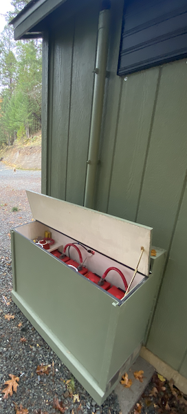

# Building a well-pump standby power system

One of the advantages of country living is that our water is supplied by a well. Unfortunately we don't always have the flow that we need, especially in the summer months.  So we added an underground cistern storage tank.   The well pump fills the cistern until the float indicates full.  To provide the appropriate domestic water pressure, an additional pump is used to pressurize a tank until the cut off switch turns off.  The pumps are typically 1/2 to 3/4 hp and run at 220 volts.  All of this is contained in a separate pump house structure from the dwellings.


The downside to this setup is that it needs electricity to keep the tank pressurized.  For a number of years we got by with a backup generator that I would have to manually start when I wanted water.   It seemed wasteful to run a generator for what is usually an intermittent load.  Once the tank has achieved appropriate pressure, you can shut it down. But then you have to start it again when the pressure drops below the limit. 

Some form of inverter/charger and backup battery configured as a standby power supply or UPS  would seem like a natural fit to this problem. We  are not eliminating the backup generator, but only using it when our batteries have drained.

### Well-pumps and surge current

A few words about well pumps.  In my case the submersible pump is a single phase three wire unit that uses a standard Goulds CentriPro controller box. The boxes consist of a potential relay and a start capacitor.  Well-pump motors have relatively high starting torque and thus have two motor windings, one for running and one that assists the start. The potential relay coil is wired in parallel with the motor start winding and the relay contact is normally closed.  As the motor speed increases,  back EMF is that is generated across the start winding.  This causes the relay to energize and take the start capacitor out of the circuit. At  about 75% motor speed and the pump proceeds on the run motor winding only. 

Because of  the high torque involved in starting,  these motors can pull quite a bit of surge current.  Pump manufacturers  refer to this as locked rotor amps (LRA).  

       

### Sizing the inverter

 Since the  typical submersible 1/2 to 3/4 hp  well pump motor runs at 220 volts and could require a fairly high startup current, you have to size your inverter appropriately. 

For my application I chose the [Sigineer Power APC6024D](https://www.sigineer.com/product/6000-watt-24-volt-to-120240-vac-split-phase-inverter-charger-pure-sine-wave/) 6KW Dual Phase Pure Sine Inverter Charger.   Not only will it power the pumps  in the event of an power outage, it will charge the batteries and keep  them topped off.

I will warn you,  this thing is a built like a tank.  It's **HEAVY**, about 70 pounds, most of that weight coming from a large power transformer which handles the surge.  The folks at Sigineer have a fairly good reputation and build solid equipment. They also have reasonable tech support.

One thing to keep in mind is that these inverters can generate some heat. According to the folks at Sigineer Power the APC6024D needs about 50 cm clearance around it,  and probably needs enough ventilation to support a minimum of 145 CFM air flow.  Just to be safe I mounted the inverted on a piece of cement backerboard and  added a thermostatically controlled ventilation fan. 


### Battery selection

There are a few thing to consider when choosing the appropriate battery technology for this design.  I went with 24 volts as a reasonable tradeoff of space and cost and decided to host the batteries just outside the pump house.   

The batteries will be most likely spend most of their lifetime in a charged or standby state.   At first I considered using  LiFePO4 but I was having a difficult time getting hold of reliable cells.  I ending up going old school  with a quality brand of flooded deep cycle lead acid cells arranged in 6 volt L16 units.  These things can crank a lot of power,  but do require you do some reasonable maintenance.   The bottom line was they were available and they have a long history of reliability.

I constructed a battery box from marine plywood with a front cover that I can slide out to access the batteries. By the way the L16 units weigh about 125 pounds each.   I designed the box with a stovepipe vent and fresh air intake to prevent hydrogen from accumulating.

​                  

The batteries are wired in a 24 volt configuration and fused with a [Blue Sea class T fuse block](https://www.bluesea.com/products/5502100/Class_T_Fuse_Block_with_Insulating_Cover_-_225_to_400A). The batteries can produce an amazing amount of current, and given the possibility of hydrogen in the box, you don't want to cut corners on this. In addition I added a [Victron Energy SmartShunt](https://www.victronenergy.com/battery-monitors/smart-battery-shunt) so I could monitor the state of charge.

### System Wiring

I used two separate circuit breaker panels in this system. One is dedicated to selecting the AC input source from utility power or standby generator.  This requires a safety [mechanical interlock](https://www.amazon.com/dp/B004Q01XSS) to prevent any power feeding back to the utility.  This also feeds the inverter input used for charging the batteries.   

A second panel is used to channel the output of the inverter to the critical circuits like the well-pump and pressure tank-pump.  The inverter also acts as a bypass when power is available at the inverter input.

I also wired a bypass breaker to allow me to take the inverter offline for any maintenance and power the pumps from the power panel directly.  Once again assembled the breakers with a safety [mechanical interlock](https://www.amazon.com/dp/B004Q01XSS).


### Inverter setup

The  Sigineer Power APC6024D is relatively easy to setup, once you get your head around the [documentation](https://www.sigineer.com/wp-content/uploads/2015/01/Sigineer-Power-1.5-6KW-Any-Power-Combi-Inverter-Charger-Owners-Manual.pdf).  There is a lot of good technical information there, but it could use some editing.   There are two places you need to do setup: the dip switches on the left side of the inverter and the battery type and charge current setting on the front panel.

In my case, I am using the inverter as a standby power supply or UPS. This means that when AC input is present from the utility or generator, the battery will be charged, and the inverter will be bypassed and  transfer the input AC to power the load. When AC power is removed, the inverter will be activated and generate power from the batteries.   Sigineer refers to this as AC Priority mode. Thus we set SW 5 into position 0 (off).  For 60 hz operation  set the SW 4 into position 1 (on).  The only other dip switch of consequence is the Power Save override SW 3.  I turned this off.  Some of my other loads  were too low to be detected.


The second set relevant settings was the battery type selector. This is straightforward for setting the boost and float voltages for your battery.  Once you have hooked everything up, you need to adjust the maximum charge current knob to fine tune for your battery setup.


### Performance

I spent some time monitoring voltages and currents and I am impressed how well this system works.   The inverter transfers from standby to inverter mode very quick enough to keep my networking and computer systems running.  It also has  a built in delay of about 15 seconds before transferring back to avoid any issues when the utility is unstable.   The important thing was it generated enough power to easily start and run both pumps at the same time.

### System status.

The APC6024D has a set of LEDs that do a good job of indicating what is going on as well as built in LCD display.  You can tell when the system is in bypass or inverter, what kind of load it's under and  current mode of charging.  

The SmartShunt has a bluetooth interface and by using the [VictronConnect app](https://apps.apple.com/us/app/victronconnect/id943840744) you can get quite a bit of data about the state of charge of the battery.


### Computer interface

Both the SmartShunt and the Sigineer Inverter have the ability to be remotely monitored via a serial line.  The SmartShunt API is defined by the [VE.Direct Protocol](https://www.victronenergy.com/live/vedirect_protocol:faq).  All you need to do is attach the [USB interface cable](https://www.amazon.com/Victron-Energy-VE-Direct-USB-Cable/dp/B01LZ6WTLW) and the SmartShunt will periodically stream a key-value set of parameters indicating battery status. This is pretty well [documented](https://www.victronenergy.com/support-and-downloads/technical-information) by Victron and turned out to be very reliable API.

The Sigineer Inverter on the other hand required us to do a little bit of work to get data from the Inverter. Sigineer Power does provide some [documentation](https://www.sigineer.com/wp-content/uploads/2015/01/Sigineer-Power-Inverter-Charger-RS232-Communicate-Protocol.pdf).  In order to communicate to the inverter you need to purchase the [PSW7 remote  control module](https://www.sigineer.com/product/remote-onoff-switch-with-lcd-monitoring-screen/) which provides a DB9 RS232 interface.  While I  believe it is possible to connect directly to the inverter using an RJ-45, I haven't worked out the details yet.   

Once you have a serial connection to the inverter, you must poll the device.  The only command that seems to work is the Status Inquiry 'Q1'. 

```
<-- Q1<cr>
-->(240.0 240.0 238.0 000 61.0 26.8 00.0 00001001<cr>
```

The return value is in the form of 

- Start Byte:  (
- Input Voltage: MMM.M
-  Input fault voltage: NNN.N 
- Output Voltage: PPP.P
- Output current (percent of max current): QQQ
- Output Frequency: RR.R 
- Battery voltage: SS.S  or S.SS
- Inverter Temperature: TT.T (turns out this does not work, ignore it)
- Status bits:  B7 - B0 (defined in documentation)

 In my initial testing I have found the Inverter's serial interface to be entirely reliable.  It will hang every so often, sometimes you can retry the query and it will recover, and other times I have had to unplug the  PSW7 remote console from the RJ-45 cable going the inverter.  This leads me to suspect that something is up with the remote console, and that I should pursue communicating with the inverter directly.   More to come on this matter...

### Conclusion

For the most part I am pretty happy with this setup.  I would have liked to use a more modern battery technology and I wish the Inverter computer interface was a bit more robust, but I can derive a lot of information about battery state from the SmartShunt.


------

[^Sigineer Power APC6024D]: (https://www.sigineer.com/product/6000-watt-24-volt-to-120240-vac-split-phase-inverter-charger-pure-sine-wave/
[^Sigineer Power Owners Manual]: https://www.sigineer.com/wp-content/uploads/2015/01/Sigineer-Power-1.5-6KW-Any-Power-Combi-Inverter-Charger-Owners-Manual.pdf
[^Sigineer Power Protocol]: https://www.sigineer.com/wp-content/uploads/2015/01/Sigineer-Power-Inverter-Charger-RS232-Communicate-Protocol.pdf
[^Victron Energy SmartShunt]: (https://www.victronenergy.com/battery-monitors/smart-battery-shunt)
[^VE.Direct USB Cable]: https://www.amazon.com/Victron-Energy-VE-Direct-USB-Cable/dp/B01LZ6WTLW
[^VE.Direct Protocol details ]: https://www.victronenergy.com/support-and-downloads/technical-information
[^VE.Direct Protocol FAQ ]: https://www.victronenergy.com/live/vedirect_protocol:faq
[^Class T Fuse]: https://www.bluesea.com/products/5502100/Class_T_Fuse_Block_with_Insulating_Cover_-_225_to_400A
[^Siemens ECSBPK01 Generator Standby Power Mechanical Interlock]: https://www.amazon.com/dp/B004Q01XSSClass 
[^NEC® Requirements for Generators and Standby Power Systems]:http://www.mikeholt.com/download.php?file=PDF/11_Generators_and_Standby_Power_Systems.pdf
[^AC Infinity AIRLIFT T14, Shutter Exhaust Fan]: https://www.amazon.com/dp/B07T93CHKJ


